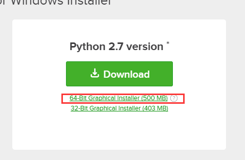
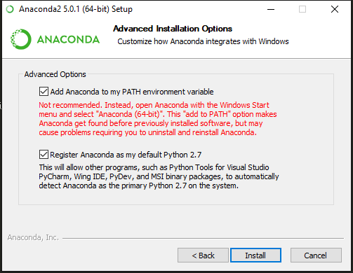
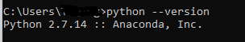
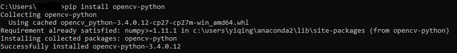
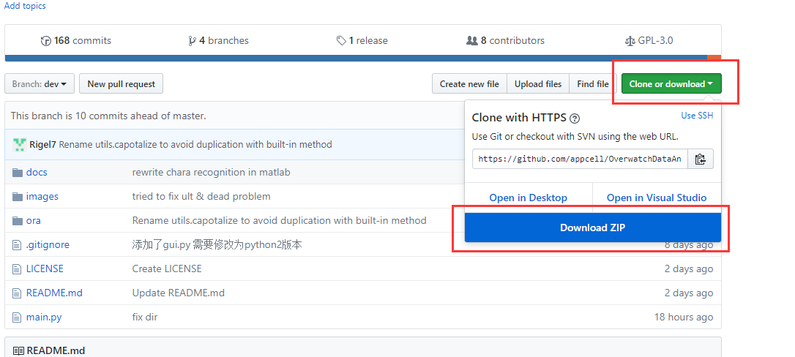
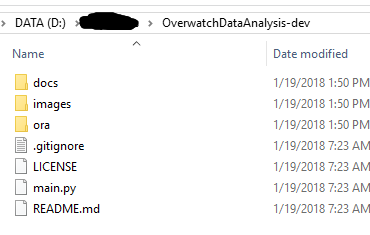
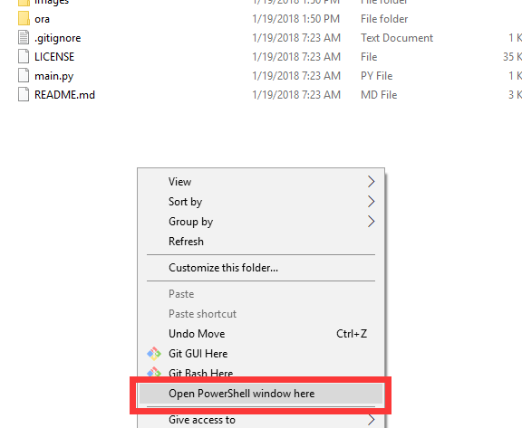
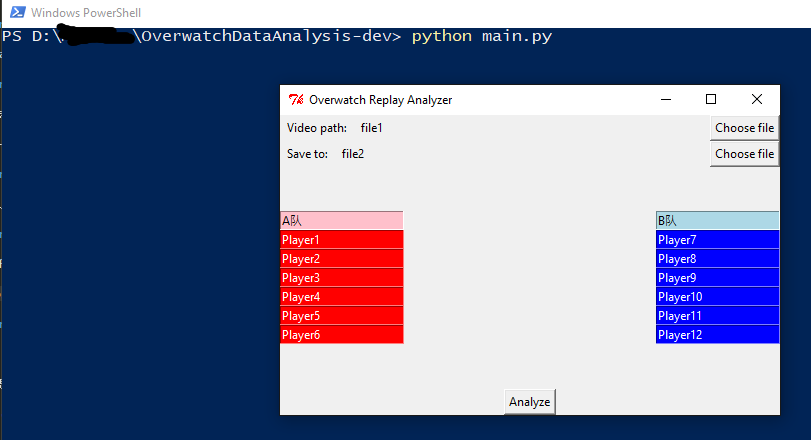

# Windows 下 Python 运行环境搭建教程

## 安装Anaconda Python 2.x

点击 https://www.anaconda.com/download/ ， 64位电脑按如下选择：

（如果提示要输入邮箱，选择 No thanks)

安装时注意要加入path，见下图，两个选项都要勾选：

然后就不停点下一步等待安装结束

安装结束以后，测试一下有没有安装成功： 在 win10 下，任务栏搜索框里输入 `cmd`， 选择第一个

然后在命令行里输入 `python --version`, 回车，如果得到如下结果：

## 安装 OpenCV for Python

在命令行里输入 `pip install opencv-python`, 得到如下图结果就是安装成功了：

## 下载代码

打开如下地址（注意是在test分支上，请点击以下地址！！！）：

https://github.com/appcell/OverwatchDataAnalysis/tree/test

点击 Clone or Download， 选择 Download Zip

把下载到的压缩包解压到一个路径没有中文的文件夹：

## 运行代码

在 OverwatchDataAnalysis-dev 文件夹中，同时按住 shift + 鼠标右键，点击空白处，选择 Open Powershell window here

在弹出的Powershell 命令行窗口里输入`python main.py`， ORA窗口会弹出，然后就可以运行了

